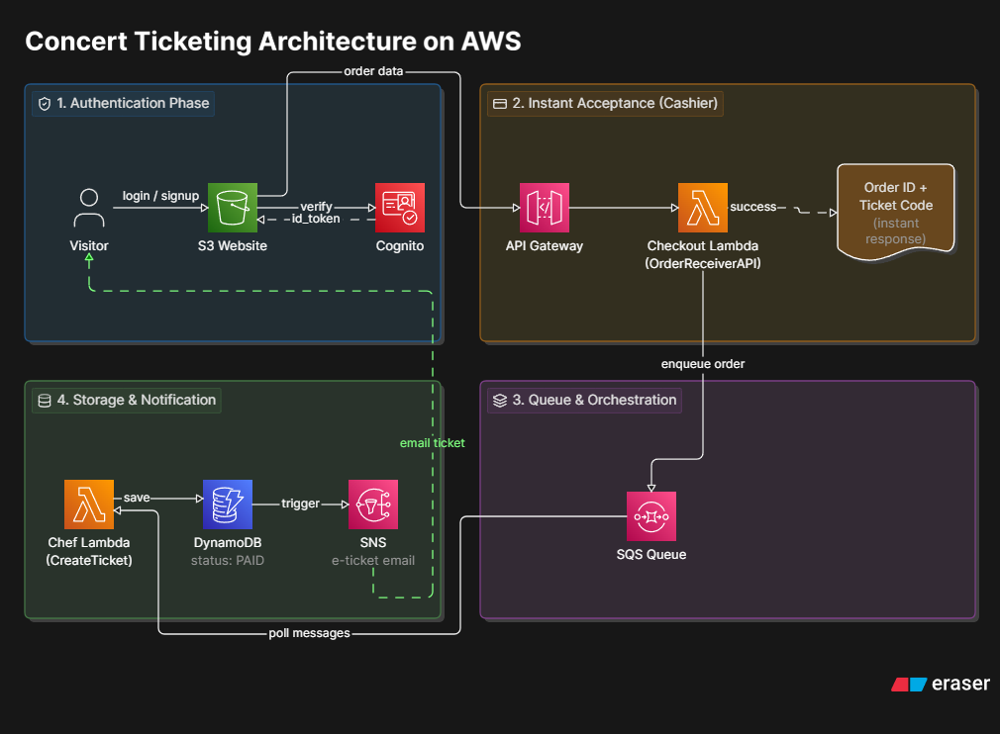

# Musiverse: Serverless Asynchronous Concert Ticketing

Sistem *web ticketing* berbasis *Cloud* (AWS) yang dirancang untuk menangani fenomena "War Ticket" tanpa mengalami *downtime*. Proyek ini mengimplementasikan **Decoupled Architecture** (arsitektur saling lepas) menggunakan penampung antrean asinkron (Amazon SQS) untuk melindungi *database* dari hantaman lonjakan trafik secara tiba-tiba.

##  Fitur Utama
* **Decoupled & Asynchronous:** Memisahkan beban kerja antarmuka pengguna (Frontend) dengan pemrosesan data (Backend).
* **Anti-Crash (High Availability):** Database tidak akan lumpuh saat *traffic spike* karena pesanan ditampung dalam antrean (*buffer*).
* **Simulasi Payment Gateway:** Antarmuka pembayaran interaktif (QRIS & Credit Card) sebelum memicu pemrosesan awan.
* **Notifikasi Instan:** Pengiriman E-Ticket digital secara otomatis via Email.
* **Serverless & Pay-as-you-go:** Infrastruktur yang secara otomatis menyesuaikan kapasitas (*auto-scaling*) tanpa perlu mengelola server fisik.

---

## Arsitektur Sistem

Sistem ini sepenuhnya dibangun di atas ekosistem Amazon Web Services (AWS) tanpa menggunakan arsitektur monolitik tradisional.




### Daftar Layanan AWS yang Digunakan:
1. **Amazon S3:** *Static Website Hosting* untuk antarmuka pembeli (`index.html`) dan admin (`admin.html`).
2. **Amazon Cognito:** *Identity Provider* untuk registrasi dan login akun pembeli dengan metode *Implicit Grant* (pengembalian token langsung).
3. **Amazon API Gateway:** *REST API Router* dengan integrasi *Lambda Proxy* dan pengamanan otorisasi token.
4. **AWS Lambda (PenerimaPesananAPI - Kasir):** Fungsi berkecepatan tinggi di garis depan untuk merespons pembeli secara instan dan melempar *payload* ke antrean.
5. **Amazon SQS (AntreanTiket):** Penengah (*Message Queue*) yang menampung pesanan masuk agar *database* tidak memproses semuanya secara bersamaan.
6. **AWS Lambda (CreateTicketFunction - Koki):** Fungsi *Worker* di belakang layar yang menyedot data dari SQS secara bertahap.
7. **Amazon DynamoDB (ConcertOrders):** Database NoSQL berkinerja tinggi untuk menyimpan catatan permanen order tiket.
8. **Amazon SNS (TicketNotification):** Layanan *Pub/Sub* pengiriman notifikasi E-Ticket melalui Email ke pelanggan.

---

##  Struktur Repositori

```text
musiverse-aws-ticketing/
│
├── frontend/
│   └── index.html        # UI Utama (Pilih Tiket, Login, Simulasi Payment)
│ 
│
├── backend/
│   ├── lambda-kasir.py   # Kode sumber Lambda 'PenerimaPesananAPI'
│   └── lambda-koki.py    # Kode sumber Lambda 'CreateTicketFunction'
│
├── docs/
│   └── arsitektur-musiverse.png  # Diagram arsitektur sistem statis
│
└── README.md
